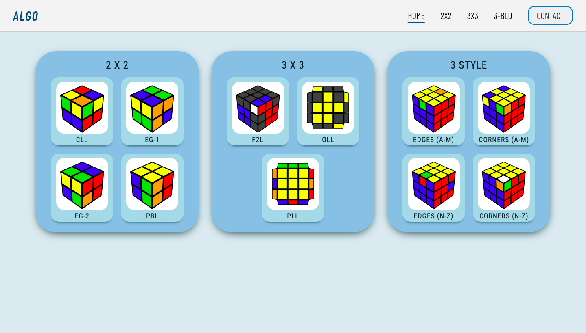
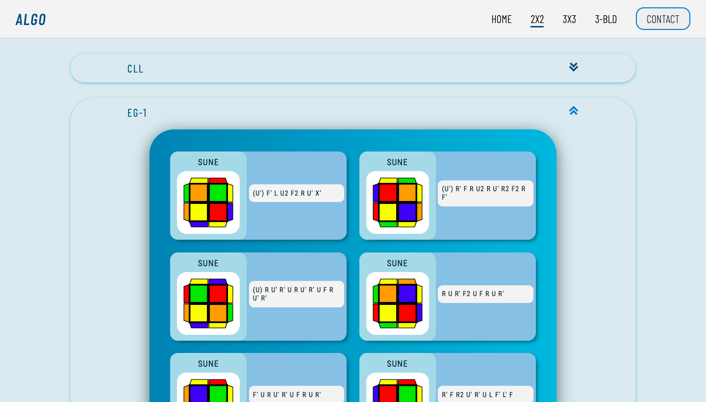
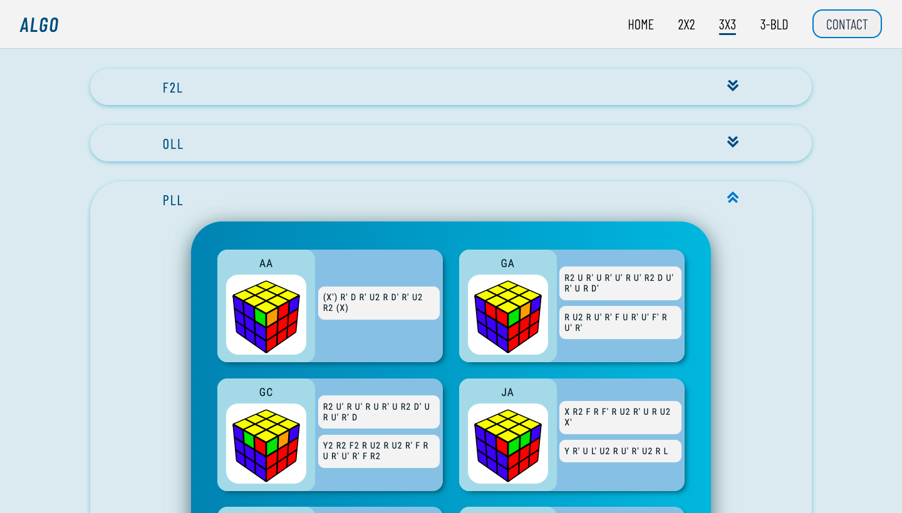
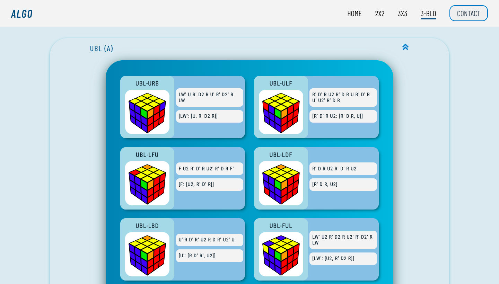
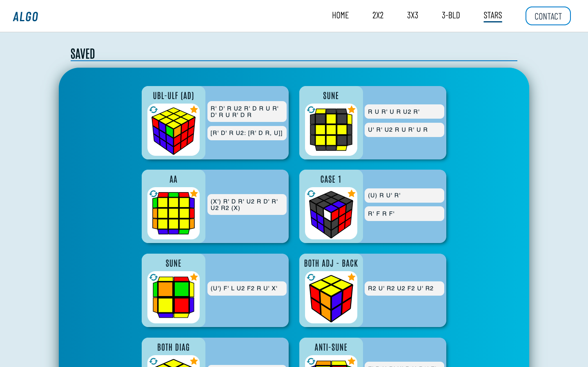
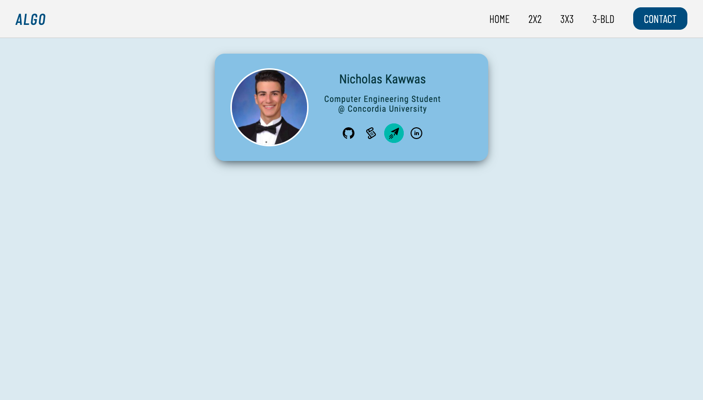

# Algo-Learn
A Cubing Website for Learning Algorithms Using a Cubing API, Written in React, Redux, and Sass
Uses Helmet for Better SEO and LocalStorage to have Persistent Data

## Usage
Home Page - Select Between Different Cubes and Algorithms\

Learn 2x2 Algs: CLL, EG-1, EG-2, PBL\

Learn 3x3 Algs: F2L, OLL, PLL \

Learn 3-BLD Algs: 3-Style for Corners and Edges\

Rotate Cube to Better View the Case from a Different Angle\

Save Your Favorite Algorithms to Practice and Enjoy\

Contact Me Through Linkedin, By Email, and View My Github Profile and Repo \
